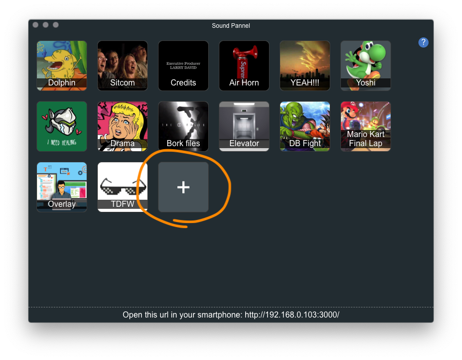
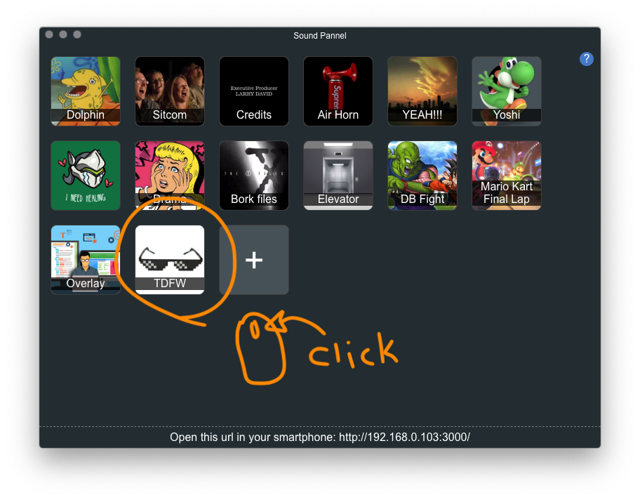
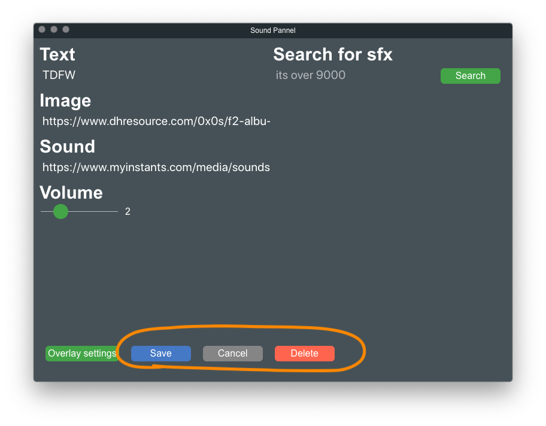
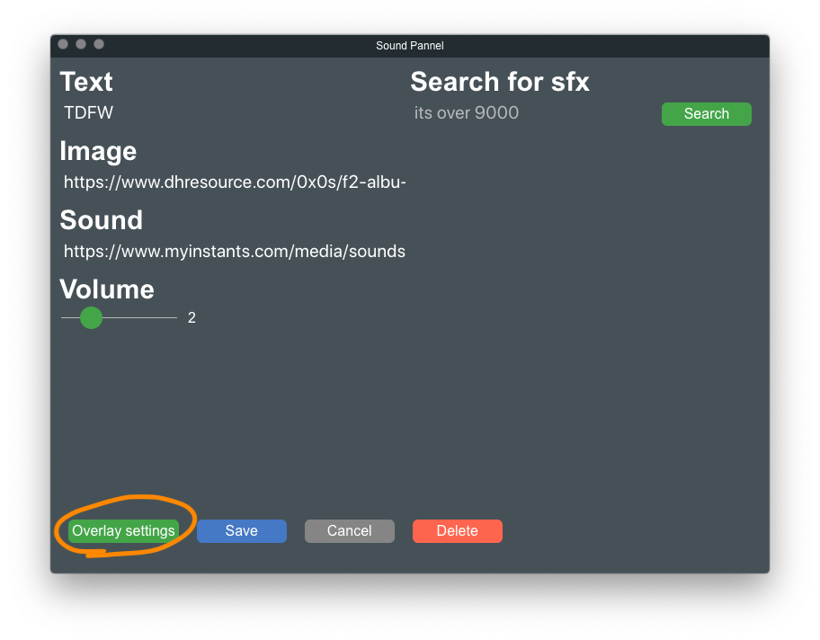
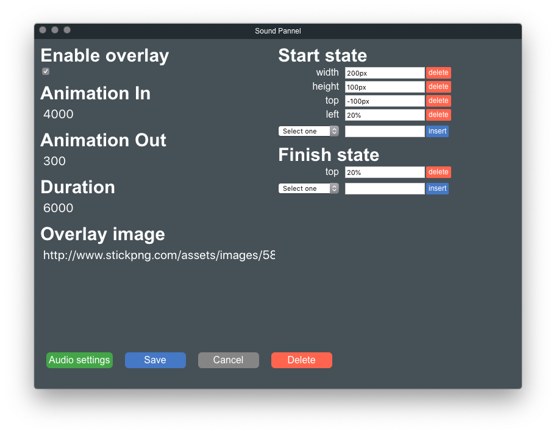
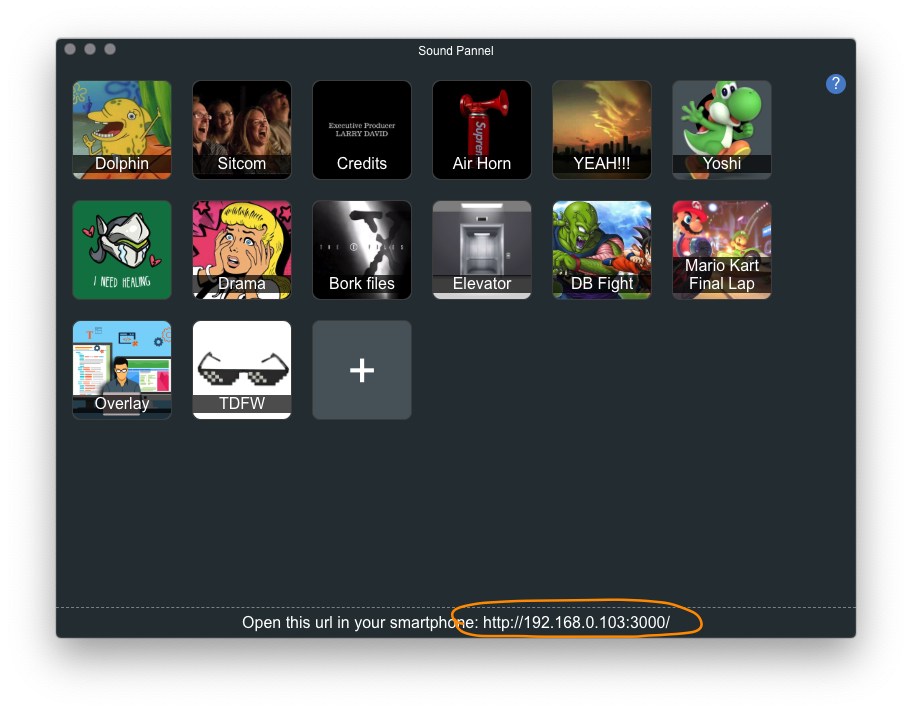
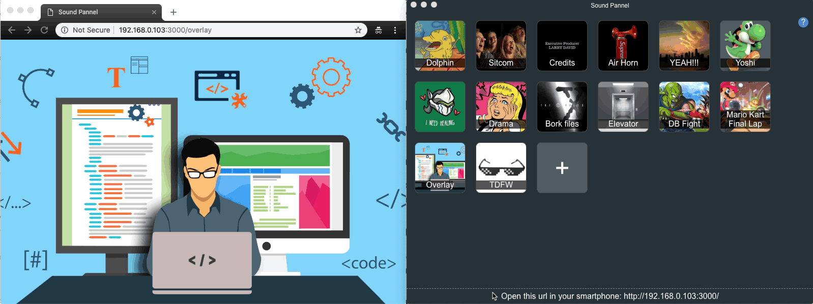

# Hola!
Sound Pannel is an app for OSX (Windows coming soon).  
You can download the latest version directly from [github build releases](https://github.com/ZeroDragon/soundpannel/releases)

# How to use it
## Add new buttons
Just click the + icon  

## Edit or delete existing buttons
Right click on an existing button and the same editor section will appear
  

## Create overlay animations
Click the section "Overlay settings", there you can add the image, animation time and what elements to animate. Take care that the same animation (reversed) will be applied for the `Animation Out`
  

## Use as remote controller
At the botton of the screen there is an URL, make sure you are on the same network and open that URL from any smartphone. Form there, tap any button and Sound Pannel will react and execute it.

## Use overlay in streaming
Just add `/overlay` to the URL and add that to your [OBS](https://obsproject.com) or [Xplit](https://www.xsplit.com/) software, any animation triggered by the Sound Pannel will be animated there.  

